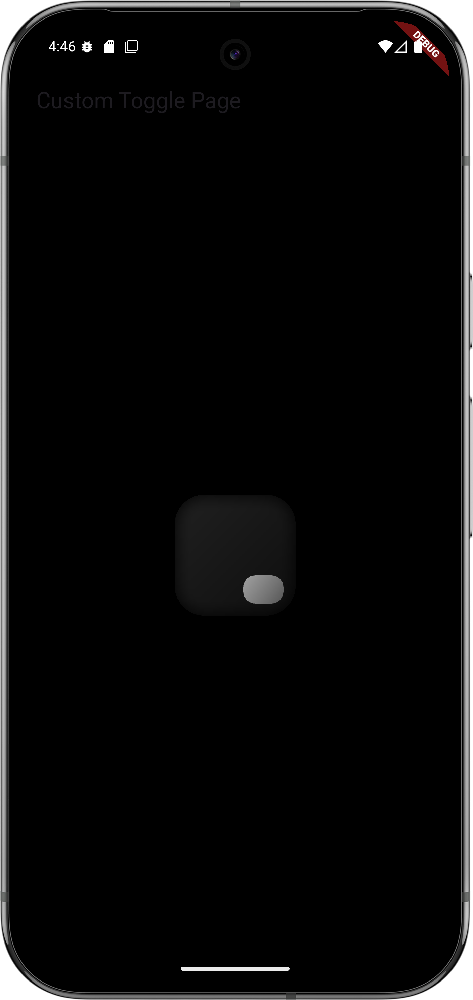
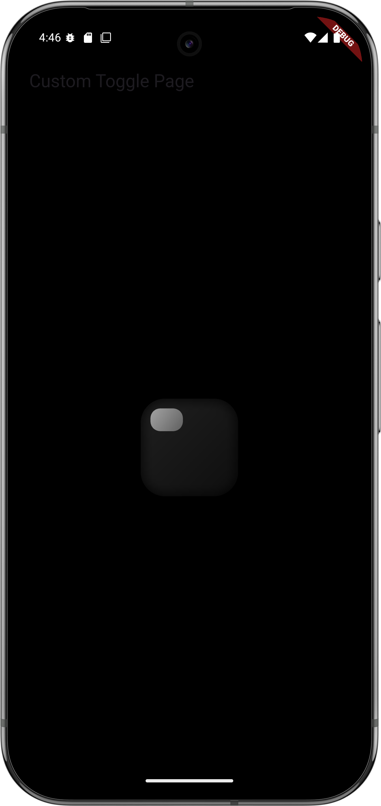

# 🔘 Toggle 2.0

An Android app built with **Kotlin/Java** and **XML UI** to demonstrate a simple toggle button functionality.  
Useful for beginners learning Android development or UI interaction.

## 📸 Screenshots

| Toggle OFF                       | Toggle ON                       |
|----------------------------------|---------------------------------|
|  |  |

---

## ✨ Features

- Toggle ON/OFF functionality
- Clean and minimal user interface
- Instant UI feedback with animations (if any)
- Light and dark mode support (if implemented)

---

## 🚀 Getting Started

To run this app locally:

1. Clone the repository:
   ```bash
   git clone https://github.com/souravkaushik-dev/toggle-2.0.git
   cd toggle-2.0
